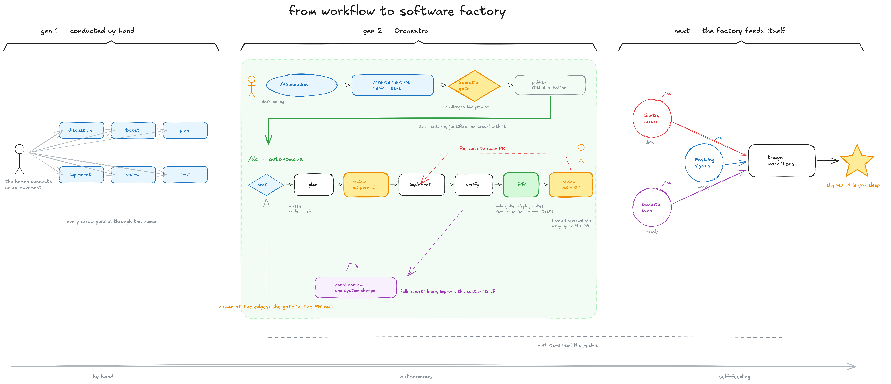

# orchestra

The canonical home of our agent skill system: Claude Code skills and
sub-agents, Codex role skills, and the shared references they point to.
Skills are edited **only here** and synced one-way into each repo that uses
them ("consumer repos"). Never edit the synced copies in a consumer repo —
the next sync overwrites them.

What the workflow is and how models are routed: [WORKFLOW.md](WORKFLOW.md).

The system at a glance:


_Source: [docs/workflow-map.excalidraw](docs/workflow-map.excalidraw)_

And the story of how it got here — conducted by hand, then Orchestra running
itself, next the factory that feeds itself:



_Source: [docs/software-factory-story.excalidraw](docs/software-factory-story.excalidraw)
· longer version in [this blog post](https://runpane.com/blog/from-workflow-to-software-factory)_

## Layout

| Directory | Contents | Synced to (in each consumer) |
|---|---|---|
| `claude/skills/` | Claude Code workflow skills (`/do`, `/create-*`, `/discussion`, `postmortem`, `codex`, `excalidraw-pr-diagrams`) | `.claude/skills/` (consumer-owned `provider-*` dirs are left alone) |
| `claude/agents/` | Claude sub-agent definitions (reviewers, researchers, verifiers, socrates) | `.claude/agents/` |
| `codex/skills/` | Codex role skills (implementer, verifiers, reviewers, researcher, investigator) — thin pointers into `references/` | `.codex/skills/` |
| `references/` | Shared skill-system documents: work-item formats, verification methods, rubrics, sub-agent role instructions and output formats | `.references/` |
| `templates/` | Per-project scaffolding (`AGENTS.md`, `CLAUDE.md`) and example artifact-provider skills (`providers/`) to copy into a new consumer repo and fill in | not synced — copied once by hand |
| `scripts/sync.sh` | The mirror logic (four `rsync --delete` targets) | — |

## The rules that keep this sane

1. **One direction.** orchestra → consumer, via PR. Each consumer repo
   carries an `update-skills` script (e.g. `pnpm update-skills` in
   bloomapi/bloom-mono) that fetches this repo's `main`, runs
   `scripts/sync.sh` against a temp worktree, and opens (or force-updates)
   the consumer's `chore/orchestra-sync` PR. Run it after pushing a skill
   change here.
2. **Repo-agnostic skills.** Nothing in the synced directories may name a
   specific codebase, database ID, or machine path. All paths are
   consumer-repo-relative (`.references/…`, `.claude/agents/…`).
3. **Repo-specific knowledge lives in the consumer repo** — its `CLAUDE.md` /
   `AGENTS.md` (e.g. the `Work-item tracking` section, including any
   artifact-provider choice and its config) or its docs. Skills know to look
   there. Platform-specific `provider-*` skills are consumer-owned too — the
   synced skills speak only the generic provider contract
   (`references/artifact-provider.md`) and default to local `./tmp/<id>/`
   artifacts plus self-contained GitHub issues.
4. **Idempotent.** The sync is a full mirror (`rsync --delete`); running it
   twice produces zero diff. Nothing in the synced dirs is written to at
   runtime.
5. **Postmortems** are filed as `postmortem`-labeled issues in the repo where
   the run happened; proposed system changes are applied here in orchestra.

## Adding a consumer repo

1. Copy `templates/AGENTS.md` and `templates/CLAUDE.md` into the repo root and
   fill in the sections (including `Work-item tracking`). To use a richer
   artifact host, copy a provider from `templates/providers/` into the
   repo's `.claude/skills/provider-<name>/` and set `provider: <name>` there.
2. Add an `update-skills` script to the repo that clones this repo and runs
   `scripts/sync.sh` in a temp worktree, then opens the sync PR —
   bloomapi/bloom-mono's `scripts/update-skills.sh` is the reference
   implementation.
3. Run it and merge the first sync PR.

## User-level install (optional)

The consumer-repo sync above is the canonical path. If you also want the
skills available in **every** repo on a machine (not just consumer repos),
mirror them into the user-level dirs:

```bash
scripts/sync-user.sh
```

It rsyncs `claude/ → ~/.claude`, `codex/ → ~/.codex`,
`references/ → ~/.references`, and rewrites the installed copies'
repo-relative `.references/` paths to `~/.references/` (the repo itself is
never touched). No `--delete`: user-level dirs are a union space — personal
skills and `p-*` preserves from other sets live alongside. To keep it fresh,
point a LaunchAgent or cron at a wrapper that fetches `origin/main`, exports
it (`git archive`), and runs the script from the export — invoke it with
`bash`, and never schedule a plain one-set rsync over these dirs.

## Manual sync

```bash
scripts/sync.sh /path/to/consumer-repo
```

The mirror primitive the consumer scripts wrap; useful for a first-time sync
or local testing. It mutates the target working tree and prints the diff —
committing and PR-ing is the caller's job.

## History

This repo supersedes the `tyler/` tree of `dcouple/skills`, which previously
synced to `~/.claude`, `~/.codex`, and `~/.references` on each machine. Skills
now travel with each consumer repo instead, so clones, CI, and cloud agents
get them with no machine setup.
