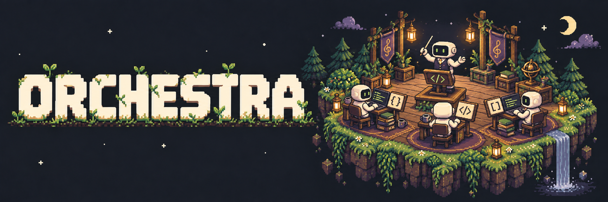
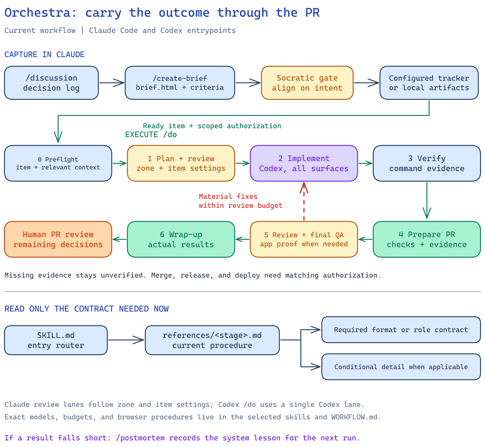
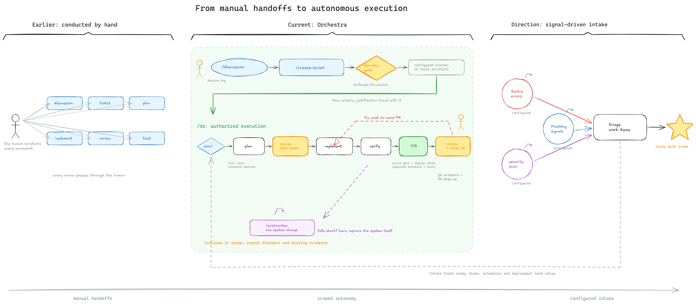
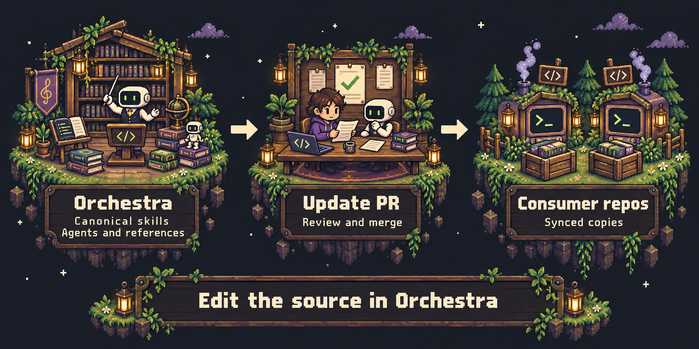

# orchestra

The canonical home of our agent skill system: Claude Code skills and
sub-agents, Codex role skills, and the shared references they point to.
Skills are edited **only here** and synced one-way into each repo that uses
them ("consumer repos"). Never edit the synced copies in a consumer repo;
the next sync overwrites them.

The system at a glance ([how the workflow runs and how models are routed](docs/workflow.md)):



_Source: [docs/workflow-map.excalidraw](docs/workflow-map.excalidraw)_

And the story of how it got here - conducted by hand, then Orchestra running
itself, next the factory that feeds itself:



_Source: [docs/software-factory-story.excalidraw](docs/software-factory-story.excalidraw)
· longer version in [this blog post](https://runpane.com/blog/from-workflow-to-software-factory)_

## Quickstart

The skill system is Markdown, HTML templates, and bash: nothing to build or
run. Working on it means editing files under `claude/`, `codex/`, and
`references/`, then syncing them into a consumer repo:

```bash
scripts/sync.sh /path/to/consumer-repo   # mirror the skills into a consumer checkout
scripts/sync-user.sh                     # optional: install them for every repo on this machine
```

The only runnable code is `daemon/`, an orchestra-only Linear agent webhook
service (Node 22). Its checks and local run are in
[daemon/README.md](daemon/README.md); operating a deployment is in
[RUNBOOK.md](RUNBOOK.md).

## Layout

| Directory | Contents | Synced to (in each consumer) |
|---|---|---|
| `claude/skills/` | Claude Code skills (`/do`, `/create-brief`, `/discussion`, `/investigate`, `/prepare-pull-request`, `postmortem`, `postmortem-loop`, `sentry-loop`, `codex`, `excalidraw-pr-diagrams`, `cold-read`) | `.claude/skills/` |
| `claude/agents/` | Claude sub-agent definitions (reviewers, researchers, verifiers, socrates) | `.claude/agents/` |
| `codex/skills/` | Codex skills: role pointers into `references/` (implementer, verifiers, reviewers, researchers, investigator, refactor-simple/-deep) plus Codex ports of `do` and `investigate` and `codex-security-scan` | `.codex/skills/` |
| `references/` | Shared skill-system documents: work-item formats, verification methods, rubrics, sub-agent role instructions and output formats | `.references/` |
| `templates/` | Per-project scaffolding (`AGENTS.md`, `CLAUDE.md`) to copy into a new consumer repo and fill in | not synced - copied once by hand |
| `daemon/` | Orchestra-only Linear agent webhook service (macOS/launchd behind a Cloudflare Tunnel); each deployment's identity comes from a site config kept in the consumer repo | not synced |
| `machines/` | Orchestra-only, versioned physical-machine setup and operations artifacts | not synced |
| `docs/` | The workflow, claudex, and daemon depth docs | not synced |
| `scripts/` | `sync.sh` (consumer mirror), `sync-user.sh` (user-level install), `check-dispatch-survival.sh` (checks that Codex dispatches survive the parent shell exiting) | - |

## The rules that keep this sane



1. **One direction.** orchestra → consumer, via PR. Each consumer repo
   carries an `update-skills` script that fetches this repo's `main`, runs
   `scripts/sync.sh` against a temp worktree, and opens (or force-updates)
   the consumer's `chore/orchestra-sync` PR. Run it after pushing a skill
   change here.
2. **Repo-agnostic skills.** Nothing in the synced directories may name a
   specific codebase, database ID, or machine path. All paths are
   consumer-repo-relative (`.references/…`, `.claude/agents/…`).
3. **Repo-specific knowledge lives in the consumer repo** - its `AGENTS.md`
   (e.g. the `Work-item tracking` section, including any custom artifact
   destination) or its docs. The skills publish work items wherever that
   section says (GitHub issues, Linear, anything the repo documents), and
   with no instructions there they stay local-only in `./tmp/<id>/`.
4. **Idempotent, entry-by-entry mirror.** `sync.sh` mirrors each top-level
   entry orchestra ships with `rsync --delete`, so those entries are exact
   copies; entries that exist only in the consumer (a repo-local skill) are
   left alone. Entries orchestra has removed are purged by name. Running it
   twice produces zero diff.
5. **Postmortems** are posted as comments on the run's work item and PR,
   never as separate tracker issues (local-only when no tracker exists);
   proposed system changes are applied here in orchestra.

## Adding a consumer repo

1. Copy `templates/AGENTS.md` and `templates/CLAUDE.md` into the repo root and
   fill in the sections (including `Work-item tracking`).
2. Add an `update-skills` script to the repo that clones this repo, runs
   `scripts/sync.sh` in a temp worktree, and opens the sync PR.
3. Run it and merge the first sync PR.

`scripts/sync.sh` mutates the target working tree and prints the diff;
committing and opening the PR is the caller's job.

## Orchestra consumes itself

The skills are available when working on this repo too: `.claude/skills`,
`.claude/agents`, `.codex/skills`, and `.references` are **symlinks** to the
canonical directories above, so there is no sync step here. Editing under
the dot-paths edits the canonical copy. Root `AGENTS.md` configures the
skills for this repo (work items publish to `dcouple/orchestra` GitHub
issues), and the Linear MCP server is wired up for both harnesses
(`.mcp.json` for Claude Code, `.codex/config.toml` for Codex; both
authenticate via OAuth on first use).

## User-level install (optional)

`scripts/sync-user.sh` rsyncs `claude/ → ~/.claude`, `codex/ → ~/.codex`,
and `references/ → ~/.references`, then rewrites the installed copies'
`.references/` paths to `~/.references/` (the repo itself is never
touched). There is no blanket `--delete`: user-level dirs are a union space
shared with personal skills. Retired orchestra agents are purged by exact
name; retired skills are not, so remove those by hand. To keep it fresh,
point a LaunchAgent or cron at a wrapper that fetches `origin/main`,
exports it (`git archive`), and runs the script from the export with
`bash`.
