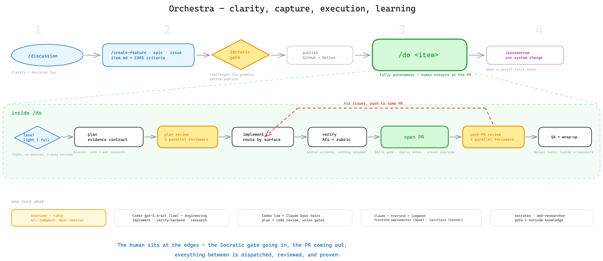

# The workflow

A dual-harness development workflow with one semantic contract. In Claude
Code, Fable is the Overseer and may dispatch Claude-native agents or detached
Codex engineering leaves. In native Codex, GPT-Sol is the Overseer and
delegates every role through native project custom agents. Harness adapters
live in `claude/skills/` and `codex/skills/`; shared workflow and role contracts
live in `references/`.

The whole system at a glance:

_Source: [docs/workflow-map.excalidraw](docs/workflow-map.excalidraw)_

The flow separates *clarity*, *capture*, and *execution*:

1. **`/discussion` / `$discussion`** — clarify, understand, figure out. General-purpose: it
   dispatches the code-researcher / `web-researcher` for questions and the
   investigator (with `frontend-verifier` for reproduction) when the topic is a
   defect. It produces clarity plus a dated decision log
   (`./tmp/discussions/`) that the `/create-*` drafting step reads — never
   deliverables.
2. **`/create-plan` · `/create-epic` / `$create-plan` · `$create-epic`** — capture skills invoked by the user or
   by the model when a conversation converges. Each turns what the conversation
   established into a lean work item at `./tmp/<id>/item.md` (Feature Ticket, Epic Spec, or Bug
   Report, raw sources in `./tmp/<id>/refs/`) with verification criteria,
   then **publishes** it wherever the project's `AGENTS.md` `Work-item
   tracking` section says (GitHub issues, Linear, anything the repo
   documents; the local `./tmp/<id>/` copy is the working truth). A repo
   with no publishing instructions stays local-only — the item lives in
   `./tmp/<id>/` and the skill says so. `/create-plan` runs the
   investigator itself if the root cause isn't already established. Before
   publish, every draft passes the **Socratic gate**: the `socrates`
   sub-agent takes an adversarial position on the item's premise (needed at
   all? root cause or symptom? simpler path? right shape? the whole of it?)
   and the user's answers — distilled into the item's `## Justification`
   section — travel with the published item. Intensity scales with the item:
   straightforward drafts fast-pass with 0–2 questions; epics always get the
   full challenge.
3. **`/do <item ref or path>` / `$do <item ref or path>`** — the autonomous pipeline: pull the work
   item's artifacts into `./tmp/<id>/` (fetched per the project
   `AGENTS.md`'s `Work-item tracking` instructions — e.g. harvested from a
   GitHub issue's artifact comments — or read from `./tmp/<id>/` when the
   repo configures no tracker) →
   zone-derived dials (`references/zones.md`) → plan + review loop (full lane backed by
   a research dossier, every plan under the evidence contract) → implement →
   verify → build gate + deploy-notes scan + PR → post-PR review loop + QA
   pass over the PR's manual tests → wrap-up, with the wrap-up posted as a
   PR comment at the end. Deliberately high-level:
   the Overseer applies the item's zone (escalating one notch at most), how much research a plan needs, and when
   each review loop has converged.
4. **`/prepare-pull-request` / `$prepare-pull-request`** — the exit ramp for ad-hoc changes made in a
   session *outside* `/do` (which handles its own PR prep). It retrofits
   the pipeline's gates before anything goes up: the Overseer materializes
   an `intent.md` + diff under `./tmp/pr-<branch>/`, Socrates challenges
   the approach in PR mode (sunk cost is not a defense; diff-vs-intent
   fidelity joins the attack lines), both code reviewers gate correctness
   (union Must-Fix, cap 3 passes), then build gate → commit → PR in the
   repo's documented format.
5. **`/postmortem` / `$postmortem`** — when a result falls short, root-cause it in *our
   system* (skill/agent/template), not just the code.

## Model routing

This table is the single source of truth for model routing. Shared contracts
name roles, not dispatch mechanisms; the two thin adapters map those roles to
their harness-native execution surface.

| Role | Claude root | Codex root | Default effort |
| --- | --- | --- | --- |
| Overseer | Fable main session | GPT-Sol main session | root-owned |
| Web research | Claude `web-researcher` | native `web-researcher` | low |
| App-driving QA / reproduction | Claude `frontend-verifier` | native `frontend-verifier` | low |
| Verify backend | detached Codex `backend-verifier` | native `backend-verifier` | low |
| Explore codebase | detached Codex `code-researcher` (Claude backup available) | native `code-researcher` | low |
| Reproduce and root-cause | detached Codex `investigator` | native `investigator` | low |
| Write the diff | detached persistent Codex `implementer` | native `implementer` | medium |
| Socratic challenge | Claude `socrates` | native `socrates` | high |
| Review the plan | parallel detached Codex + Claude `plan-reviewer` | parallel native reviewers | low/high by lane |
| Review the diff + security | parallel detached Codex + Claude `code-reviewer` | parallel native reviewers | low/high by lane |

Under a Claude root, every detached Codex role is dispatched by the
infrastructure-only **`codex` skill** (`claude/skills/codex/`), which owns
`codex exec` mechanics, output capture, and resumption. Under a Codex root,
workflow adapters explicitly spawn and await project-scoped
`.codex/agents/*.toml` roles through native collaboration tools; those agents
are leaves and never launch another agent or agent CLI.

Review loops exit when **no Must Fix remains from either reviewer** — a
Codex report tiered P0–P3 maps rather than reformats (P0/P1 ≡ Must Fix,
P2 ≡ Should Fix, P3 ≡ Nice to Have). Caps are ceilings, never quotas: a
zero-Must-Fix pass ends the loop even with Should Fixes open (the Overseer
applies those at its discretion, no re-review), and the only other trigger
for an extra pass is the two lanes sharply diverging. When reviewers disagree,
the Overseer adjudicates directly, using sub-agents to understand what is true
when needed. The Overseer flags anything left unresolved at a cap in the
wrap-up. Codex efforts are defaults — `medium` for the implementer and `low`
for every other role. A native dual-review pass explicitly starts distinct
low- and high-effort children for the same input; a single pass retains the
low default unless a recorded escalation is warranted, never above `high`.
The do and prepare-pull-request workflows are user-invoked only in both
harnesses. The two create capture workflows remain model-invocable at
convergence, with publish still gated by their alignment pause.

## Where formats live (single copy each — no duplicates to drift)

- **`references/workflows/`** (synced to `.references/workflows/`) — one
  harness-neutral semantic contract per workflow plus shared
  `formats-and-assets/`. No dispatch syntax or harness-specific lifecycle
  behavior lives here.
- **`references/agents/`** — one role charter and one output-format contract
  per delegated role, shared by Claude agent definitions, detached Codex
  leaves, and native Codex custom agents.
- **`references/`** (synced to `.references/` in each consumer repo) —
  other shared blocks (`verification-criteria.md`,
  `verification-methods.md`, `rubrics/` — per-surface verification rubrics,
  `code-quality.md` — the reviewers' house-rules rubric, `qa-verification.md`
  — the QA pass's external-evidence discipline, `system-analysis.md`,
  `publish-work-item.md`, `draft-work-item.md`,
  `socratic-gate.md`) and every agent's output format
  (`references/agents/<agent>/…`).
- **`claude/skills/` and `codex/skills/`** — thin harness adapters only.
  Claude definitions retain Claude frontmatter and lifecycle rules; Codex
  definitions use explicit `$skill` entrypoints and native collaboration.

The advertised Codex skill surface contains orchestrator-facing workflows
only. Engineering roles are native custom agents, not duplicate role skills.
Claude retains the private `codex` dispatcher because its detached leaves use
`codex exec` directly.

## Keeping in sync

See [README.md](README.md): skills are edited only in this repo and mirrored
one-way into each consumer repo by that repo's `update-skills` script
(`pnpm update-skills` in bloomapi/bloom-mono), which wraps `scripts/sync.sh`.
The old per-machine rsync to `~/.claude`, `~/.codex`, and `~/.references` is
retired.
