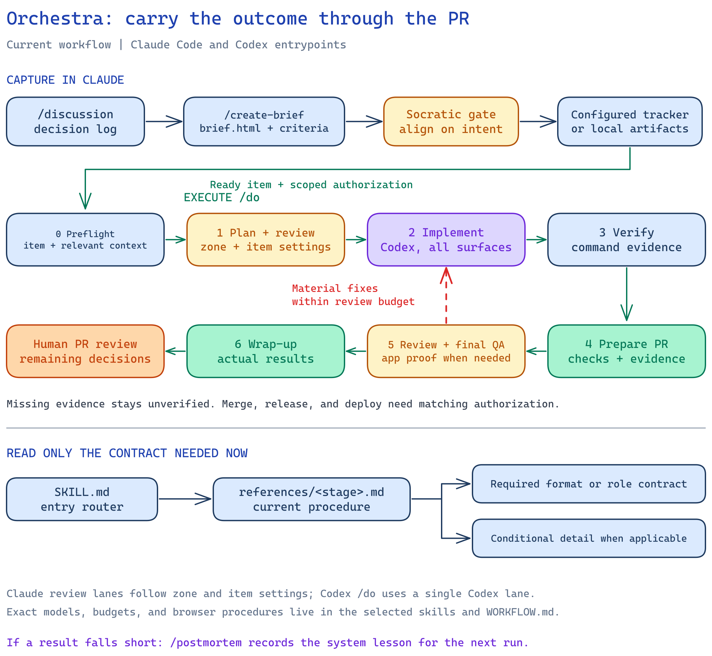

# The workflow

Orchestra captures a work item, executes its scoped outcome, and hands over a
reviewed PR with evidence. Claude Code and Codex have separate `/do`
entrypoints. They share artifacts and role contracts while retaining their
own dispatch, review-budget, and browser procedures.

_Source: [docs/workflow-map.excalidraw](docs/workflow-map.excalidraw)_

## Choose the entrypoint

| Need | Entry | Result |
| --- | --- | --- |
| Clarify an idea or decision | [Claude `/discussion`](claude/skills/discussion/SKILL.md) | Clarity and a dated decision log under `./tmp/discussions/` |
| Reproduce and explain a defect | [Claude `/investigate`](claude/skills/investigate/SKILL.md) or [Codex `/investigate`](codex/skills/investigate/SKILL.md) | Root-cause evidence for the next decision |
| Capture a work item | [Claude `/create-brief`](claude/skills/create-brief/SKILL.md) | `brief.html`, acceptance criteria, justification, and supporting `refs/` |
| Execute a ready work item | [Claude `/do`](claude/skills/do/SKILL.md) or [Codex `/do`](codex/skills/do/SKILL.md) | Implementation, review, QA, PR, and wrap-up |
| Prepare ad-hoc changes for review | [Claude `/prepare-pull-request`](claude/skills/prepare-pull-request/SKILL.md) | Intent check, Socratic challenge, code review, build gate, and PR |
| Learn from a result that fell short | [Claude `/postmortem`](claude/skills/postmortem/SKILL.md) | System-level root cause and an improvement proposal |

`/create-brief` runs the Socratic gate before publication and preserves its
alignment pause. Work items follow the consumer's `AGENTS.md` work-item
tracking configuration. An artifact host carries the complete bundle with a
lean tracker body; other configured destinations follow the
[publishing contract](references/publish-work-item.md). With no configured
destination, artifacts stay local under `./tmp/<id>/`.

`/do` is user-invoked (`disable-model-invocation: true`). Invocation metadata
for other skills lives in their own frontmatter.

## Execute by stage

Read `references/execution-boundaries.md` once from the selected `/do`
directory, then load the current stage. Paths inside stage files resolve from
that skill directory. Shared `.references/` paths resolve from the consumer
repo, or from the rewritten user-level installation.

| Stage | Contract file in each `/do/references/` | Work |
| --- | --- | --- |
| 0 | `preflight.md` | Load the ready item and its criteria; inspect relevant project instructions, tools, and working state |
| 1 | `plan.md` | Apply zone and explicit item settings; gather the required research and review the evidence-backed plan |
| 2 | `implement.md` | Implement the scoped change and integrate review fixes |
| 3 | `verify.md` | Prove command-shaped criteria; carry app-only criteria into final QA |
| 4 | `pull-request.md` | Build gate, deploy-notes scan, commit, push, and prepare the PR with its required evidence |
| 5 | `review-qa.md` | Review the PR, resolve material findings within budget, and perform the applicable final QA |
| 6 | `wrap-up.md` | Record actual results, unresolved evidence, run statistics, and the PR handoff |

The stage routers are the [Claude `/do`](claude/skills/do/SKILL.md) and
[Codex `/do`](codex/skills/do/SKILL.md) roots. Their linked files contain the
full procedures, output formats, and harness-specific exceptions. Load
conditional references only when their subject applies. A docs-only change
does not require an app boot, and passing evidence remains usable until a
relevant input changes.

Stages continue under existing authorization. Local branch/worktree creation,
scoped fixes, and relevant checks are part of execution. A planning-only
request still returns its plan, and a prepared PR does not authorize merge,
release, deployment, production changes, or broader scope. Missing evidence
is recorded as blocked or unverified.

Multi-phase items persist phase state in `plan-<n>.md` and chain phases
without a new permission prompt. Review accounting follows the selected
entrypoint; consult its phase and review-stage rules before dispatching.

## Role and model routing

Executable routing lives in the skills and agent definitions linked below.
This overview describes those contracts rather than duplicating model IDs
that can drift from dispatch code.

| Role | Claude `/do` | Codex `/do` |
| --- | --- | --- |
| Overseer | Main session; configured Claude/Claudex runtime | Main Codex session |
| Implementation | Codex `implementer`, default effort `medium`, all surfaces | Codex `implementer`, default effort `low`, all surfaces |
| Code research, investigation, backend verification | Codex roles through the dispatcher | Matching Codex role skills |
| Plan and code review | Zone-derived lanes; dual Codex + Claude at zone 0 by default, Codex alone at zones 1–3; explicit item/runtime settings apply | Single Codex lane under this entrypoint |
| External research | Claude `web-researcher` | Codex `web-researcher` |
| App-driving final QA | Claude `frontend-verifier` | Codex `frontend-verifier`, local Playwright by default |

The [Claude-to-Codex dispatcher](claude/skills/codex/SKILL.md) owns its
configured model, effort, session, timeout, and result collection rules.
Its [dispatch reference](claude/skills/codex/references/dispatch.md) loads
only for a launch, resume, or collection operation. Read-only role charters
and active harness permissions still apply to unattended CLI settings.

Reviewers are independent of the implementer. A clean Must-Fix result ends
the applicable review pass; budgets are ceilings. The
[zones reference](references/zones.md) defines stakes and shared dials, while
the selected entrypoint and review stage specify its lane and budget rules.
Explicit item settings and documented runtime fallback remain visible in
the plan and wrap-up. Optional tools such as `arena` are used only when their
work would resolve material uncertainty and the tool is available.

## Sources and supporting tools

- [Shared references](references/README.md) hold work-item formats,
  verification methods, rubrics, role instructions, and role output formats.
- Each skill's own `references/` directory holds its stage procedures and
  private formats. Both `/do` roots link to the implementation-plan, PR-body,
  and wrap-up formats they produce.
- [Claude skills](claude/skills/README.md), [Codex skills](codex/skills/README.md),
  and [Claude agents](claude/agents/README.md) identify the current surface,
  including the postmortem and Sentry loops, manual cold-read, refactoring
  roles, and [Excalidraw diagrams](claude/skills/excalidraw-pr-diagrams/README.md).

## Installation and visuals

The [README](README.md) documents consumer-repo sync and the supported optional
user-level installer. Consumer changes go through their authorized sync PR
flow. [The visual index](docs/README.md) distinguishes the executable workflow
map from the broader software-factory direction and explains regeneration.
