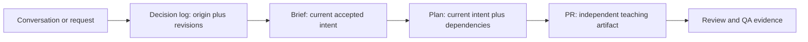
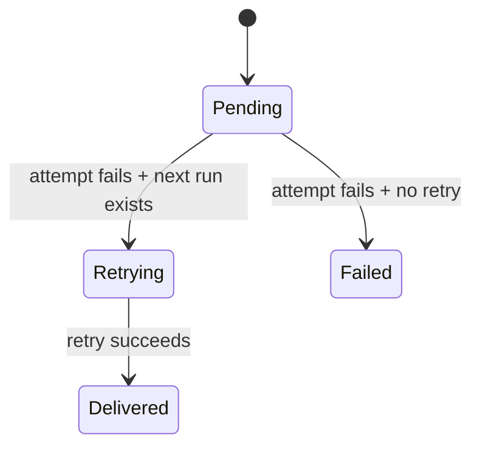

# Intent fidelity and PR writing

This reference is shared by `/discussion`, `/create-brief`, `/do`, and
`/prepare-pull-request`. It keeps the origin and evolving accepted intent
traceable as work moves from conversation to brief to plan to pull request,
and it gives a reader who has no conversation history enough context to review
the result.

The companion PR-body reference still owns the required section spine, manual
test checklist parsing, tracker closing lines, evidence comments, visual
overview rules, and artifact-host fallback. This document adds provenance and
teaching requirements; it does not replace or reorder that contract.

## The handoff

Carry two related records forward. The **origin** is the starting request or
idea; the **current accepted intent** is what discussion, evidence, the
existing Socratic gate, and user alignment have forged, refined, or rejected.
The current accepted intent steers the plan and PR. Preserve the origin and a
decision trail showing what changed, why it changed, and which constraints or
outcomes were superseded. No stage may silently invent a new current intent or
force an obsolete origin after the workflow has accepted a refinement.



At every handoff, preserve these fields. The first three distinguish where the
request started from what the workflow currently accepts:

| Field | Required content | If the source is missing |
|---|---|---|
| Origin / starting request | The initial request, idea, defect report, or desired direction, with its source | Write `Origin not established`; do not reconstruct an initial request from the final diff. |
| Current accepted intent | The latest agreed outcome, scope, and approach after discussion, evidence, the existing Socratic gate, and required user alignment | Stop calling it accepted; carry the unresolved question through the existing workflow gate. |
| Decision trail | Each material revision, its reason/source, and superseded constraints, outcomes, or approaches | Write `Decision trail incomplete` and identify the missing source. |
| Trigger | The event, request, defect, or threshold that started the work | Write `Trigger not established` and name the question. |
| Why | The user or system problem and evidence that makes it matter | Write `Why not established`; do not turn a guess into a fact. |
| Intended outcome | The observable state that should exist after the change | Ask or derive only from an explicit outcome already established. |
| Constraints | Compatibility, safety, timing, interfaces, or other boundaries | Mark each proposed boundary as an assumption until confirmed. |
| Non-goals | Adjacent behavior deliberately left unchanged | Write `Not established` when the conversation did not set one; do not invent exclusions. |
| Rationale | Why this approach is acceptable and what alternative it rejects | Separate `Rationale not established` from an assumption about the approach. |
| Assumptions | Propositions used to proceed without source confirmation | Label each `Assumption`, state its validation path or owner, and carry it to Open questions or limits. |
| Sources | Links, paths, line references, commands, or quoted user decisions | Record `source unavailable` rather than fabricating a citation. |

In intent records, use compact source labels for material claims; a source
ledger or grouped labels can cover related prose in a brief or plan. PR prose
should remain readable, with source links where a reviewer needs to verify a
claim - do not mechanically tag every sentence:

`[user]` · `[tracker]` · `[decision-log]` · `[code: path:line]` · `[test: command]`
· `[QA: evidence]` · `[research: URL]` · `[inference]` · `[assumption]`

An inference explains what was concluded from cited facts. An assumption is a
premise the work needs but has not established. Missing rationale means the
reason for choosing or prioritizing the work is unknown; it does not mean the
choice is an assumption. Keep both visible. If a refinement has been accepted,
show the earlier origin and the current choice together:

```text
Origin: Add a response field for every retry state [user].
Current accepted intent: Keep the response enum stable and improve the
presentation only [user agreement; decision-log].
Decision trail: Socrates surfaced compatibility risk; the user accepted the
presentation-only scope [socratic; user agreement].
Rationale for prioritizing this work: not established in the request or
tracker.
Assumption: The scheduler's next-run value is present for every retryable
failure [assumption]; validate with the integration test [test: ...].
```

## Write the why before the how

Use this order when extracting intent, regardless of which document you are
authoring:

1. **Trigger** - what happened or was requested, with its source.
2. **Observed problem and impact** - what is wrong now, who or what it affects,
   and the evidence.
3. **Intended outcome** - the user-visible or operational state that counts as
   done.
4. **Constraints and non-goals** - what must remain true and what this work
   leaves alone.
5. **Rationale and alternatives** - why this shape fits the evidence; name a
   rejected alternative only when the conversation or research actually
   considered it.
6. **Assumptions and open questions** - unresolved premises, validation, and
   owner where known.

The plan and PR follow the current accepted intent; they do not force the
origin when the workflow has deliberately refined it. They may add
implementation facts and proof, but they may not silently redefine the current
outcome, scope, or approach. If later evidence disproves the current intent,
record the mismatch and use the existing discussion/Socratic/user-alignment
path, where applicable, to accept a revision before changing the plan or PR.

## Teach the changed areas in dependency order

The PR body is useful to a junior engineer when every changed area answers the
same small set of questions:

```text
Concept or invariant → dependency → behavior before/after → edge cases
→ changed area → proof at a tested SHA → QA coverage and limits
```

Start with the concept and the dependency it relies on. Then explain the
behavioral change, map it to the relevant modules or files, and close the loop
with proof. Group files by concept rather than listing the diff in filesystem
order. For each area, include a concrete input/output or state transition when
one makes the behavior easier to judge. A small diagram is useful for a flow,
boundary, lifecycle, or dependency relationship; keep it in the PR body or a
durable linked artifact according to the existing visual-overview rules.

The body must stand on its own if an artifact host is unavailable. Include the
intent summary, changed-area map, tested commit SHA, exact checks and results,
QA coverage, and known limits in the body. Screenshots, long logs, and
transcripts remain proof attachments or comments under the existing
publication rules; a host URL is supplementary context, never the only
explanation of what changed or why.

When the existing artifact-host wrap-up is generated, include or render the
final PR explanation with section navigation, diagrams, and links between
changed code and its evidence. Reconcile that presentation against the final
PR body after reviews, QA, and CI settle, so its state and links describe the
accepted head. This is a presentation pass over the existing host procedure;
it adds no new host or presentation dependency and does not change the
fallback.

## Completed fictional example

The following example is fictional and uses generic paths and identifiers.
It demonstrates the level of detail, not a prescribed product design.

### Intent record

```text
Origin: Operators asked for a visible retry state and initially suggested a
new status value [user].
Socrates challenge: Would changing the status enum break existing consumers,
and can a display state be shown without claiming a retry is scheduled
[socratic]?
Current accepted intent: Show `retrying at <time>` only when the scheduler has
a next run, while keeping the existing status values and retry behavior
[user agreement; decision-log].
Decision trail: The compatibility concern superseded the proposed enum change;
the presentation-only scope was accepted after Socrates [socratic;
user agreement].
Trigger: A delivery attempt fails and may have a scheduled retry [code:
src/jobs/retry-scheduler.ts:72-96].
Why: The current status only says "pending", so an operator cannot tell whether
the next attempt is scheduled or whether the delivery is stuck [code:
src/status/formatter.ts:18-31; QA: support reproduction].
Intended outcome: After a failed attempt, the status shows the next retry time;
after the retry succeeds, it returns to "delivered" [user; test:
tests/delivery-status.spec.ts].
Constraints: Preserve the existing status values consumed by the list endpoint
[code: src/api/status.ts:40-62].
Non-goals: Change retry timing, add a new delivery provider, or redesign the
operator table [decision-log].
Rationale: Reusing the scheduler's existing next-run value avoids a second
clock and keeps the display tied to the behavior operators need [code:
src/jobs/retry-scheduler.ts:72-96; decision-log].
Assumption: The scheduler's next-run value is present for every retryable
failure [assumption]; the integration test will cover a missing value.
Sources: user request; decision log; cited source files; focused test command.
```

### PR teaching pass

**Summary - What / Why / How**

The delivery status now shows `retrying at <time>` when a failed attempt has a
scheduled retry. The trigger was an operator report that `pending` hides a
stuck delivery. The origin request suggested a new retry status, but Socrates
surfaced compatibility risk and the user accepted a presentation-only outcome:
the status distinguishes waiting from retrying while preserving the existing
API status values. The formatter reads the scheduler's existing next-run value,
so retry timing and provider selection stay unchanged.

**Visual overview**



**How / changed areas, in dependency order**

1. **Retry state source** - the scheduler already records the next run; the
   change exposes that value to the status formatter. A missing value does not
   synthesize a retry: `{status: "pending", nextRunAt: null}` stays `pending`,
   while `{status: "failed", nextRunAt: null}` stays `failed`.
2. **Status formatter** - maps `nextRunAt` to `retrying at <time>` while
   retaining the existing API enum. Input `{status: "pending", nextRunAt: T}`
   produces the retrying label; the null cases keep their existing status.
3. **Verification** - focused unit and integration tests cover the scheduled,
   missing, and successful paths.

**Verification**

Tested SHA: `7f4c2a1` (fictional). `npm test --
tests/delivery-status.spec.ts` passed: 6 tests. Typecheck passed. The PR
reviewed the existing API contract test and the scheduler integration test.

**QA results and limits**

QA drove the scheduled retry and success paths with marker
`qa-example-2026-01-01` and read back the resulting status. The no-retry branch
was covered by the integration test but not driven in the UI. Provider delivery
and production timing were not tested; those limits remain for the human.

This example is self-contained: the host for screenshots or logs can change
without removing the reason, concept map, SHA, checks, or limits from the PR.

## Adaptable skeleton

Use this as a fill-in guide. Keep the actual PR sections and ordering from the
invoking PR-authoring skill's `references/pr-body.md`; these fields belong in
the appropriate existing sections rather than in an extra mandatory section.

```text
Intent record
- Origin / starting request: <initial idea or request> [source]
- Current accepted intent: <latest agreed outcome, scope, and approach>
  [user agreement | decision-log | existing gate]
- Decision trail: <material revision, why, and superseded constraint/outcome>
  [source]
- Trigger: <event/request/defect> [source]
- Why and impact: <problem, affected user/system, evidence> [source]
- Intended outcome: <observable done state> [source]
- Constraints: <must remain true> [source | assumption]
- Non-goals: <deliberately unchanged> [source | not established]
- Rationale: <why this approach; alternatives actually considered>
  [source | Rationale not established]
- Assumptions: <premise, validation path or owner> [assumption]
- Open questions: <unresolved judgment; who/when resolves it>
- Sources: <user/tracker/decision log/code/test/QA/research references>

Summary - What / Why / How
- What: <behavioral outcome>
- Why: <trigger → evidence → impact>
- How: <concepts and dependencies in order>
- Done means: <checkable outcome tied to the intent>

Changed areas, in dependency order
1. <concept/dependency> → <behavior and edge case> → <path/module>
2. <concept/dependency> → <behavior and edge case> → <path/module>

Visual overview
- <before → after diagram or the explicit no-visual line required by the
  PR-body reference>
- <screenshots and hosted-artifact links according to the existing rules>

Verification
- AC#: <exact criterion> → <command/transcript/result> [tested SHA]
- AC#: <exact criterion> → <QA proof or explicitly not verified>

Manual tests / QA results
- <checkbox mapped to the changed behavior and journey, if applicable>
- <executed vs left to human, cleanup, and proof comment>

Residual risks / limits
- <coverage gap, environment boundary, or deferred follow-up>
```

## Review rubric

A writing pass is ready when every applicable check is true:

- **Source fidelity** - Trigger, Why, intended outcome, constraints, and
  non-goals trace to user/tracker/decision sources; inference and assumption
  labels are visible.
- **Current-intent fidelity** - the origin/starting request is distinguishable
  from the current accepted intent; plans and PRs follow the current intent,
  and each material revision records its reason and source.
- **Gate fidelity** - refinements or rejected approaches are supported by the
  existing discussion, Socratic, evidence, and required user-alignment path;
  the writing guidance adds no new pause and permits no silent redefinition.
- **Rationale honesty** - established rationale is cited; missing rationale is
  stated as missing; assumptions are separately named with validation or an
  owner.
- **Concept order** - a zero-context junior can follow the dependency and
  lifecycle before reading individual file details.
- **Changed-area coverage** - every meaningful changed area has a concept,
  behavioral example or edge case, and a link to its proof.
- **Evidence** - the tested SHA, exact checks, QA paths, and cleanup are stated;
  unverified behavior and environment limits are explicit.
- **Scope** - the narrative explains why each area belongs and does not claim
  alternatives, sources, or outcomes the record does not support.
- **Host independence** - the PR remains understandable if artifact links are
  unavailable; existing evidence-publication and fallback rules are preserved.
- **Contract preservation** - the required PR-body spine, manual-test syntax,
  tracker lifecycle, review gates, and artifact-host behavior remain intact.
